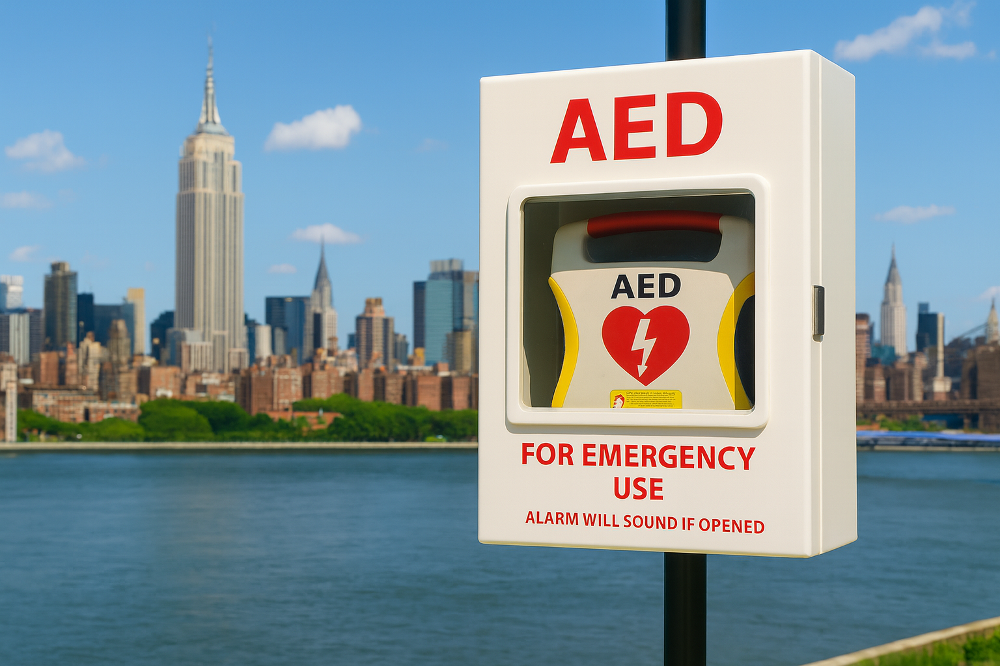

### **Overview**
- screencast

### **Data Source** 

**1) NYC Automated External Defibrillator (AED) Inventory**  
Lists registered AED locations in public facilities across NYC.  
Source: NYC Open Data (DOHMH)  
https://data.cityofnewyork.us/Health/New-York-City-Automated-External-Defibrillator-AED/2er2-jqsx/about_data  

**2) Automated Traffic Volume Counts (2019–2024)**  
Lists vehicle counts by intersection, year, and borough.  
Source: NYC Open Data (DOT)  
https://data.cityofnewyork.us/Transportation/Automated-Traffic-Volume-Counts/7ym2-wayt/about_data  

**3) NYC Leading Causes of Death (through 2021)**  
Annual cause-specific mortality data aggregated citywide.  
Source: NYC Open Data (DOHMH)  
https://data.cityofnewyork.us/Health/New-York-City-Leading-Causes-of-Death/jb7j-dtam/about_data

### **Contributors and UNIs** 

1. Nichcha Subdee (ns3923)  
2. Mukta Patwari (msp2210)  
3. Medha Tulsyani (mt3866)  
4. Juhi Mattekatt (jm5916)  
5. Maliha Safdar (ms7354)

